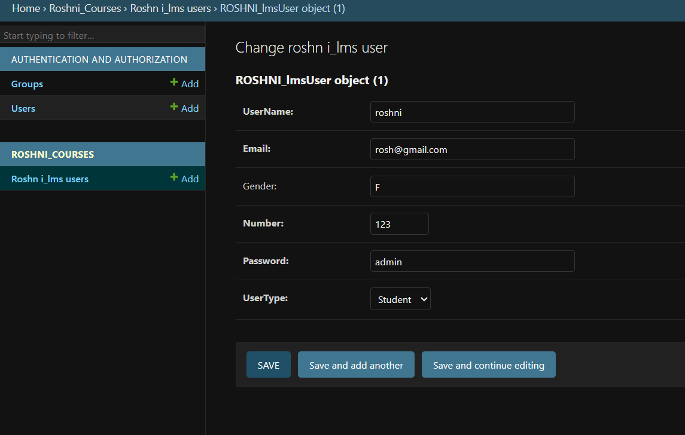
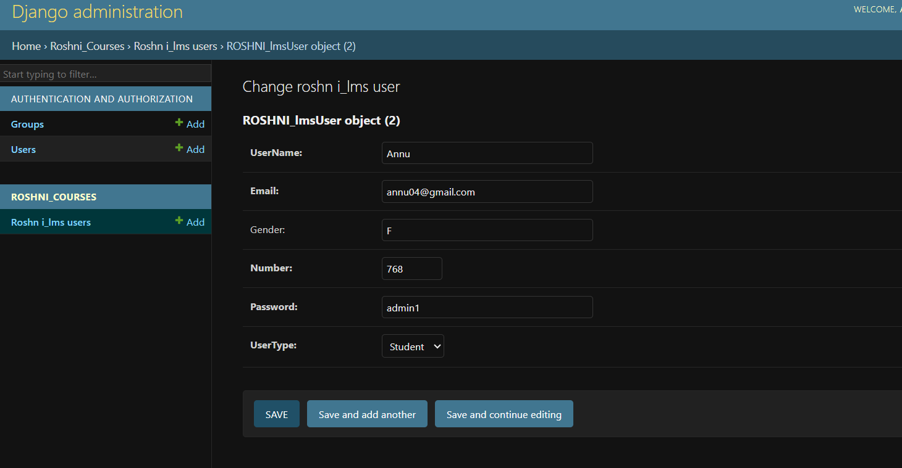
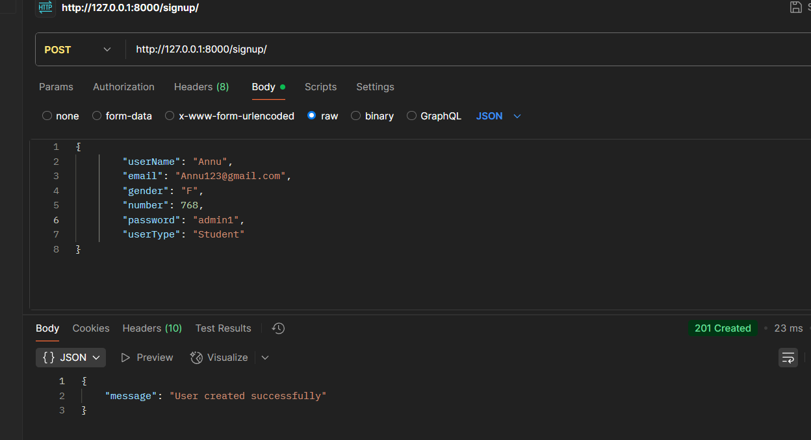
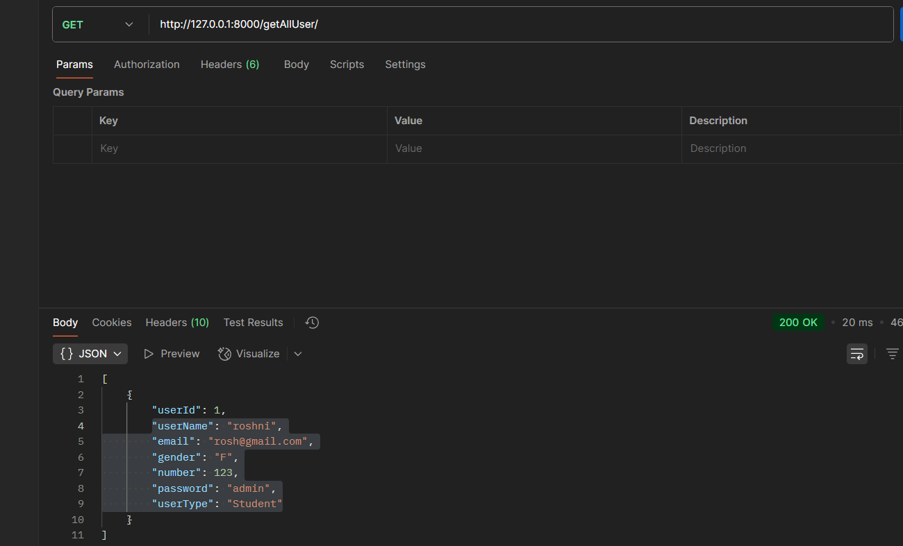
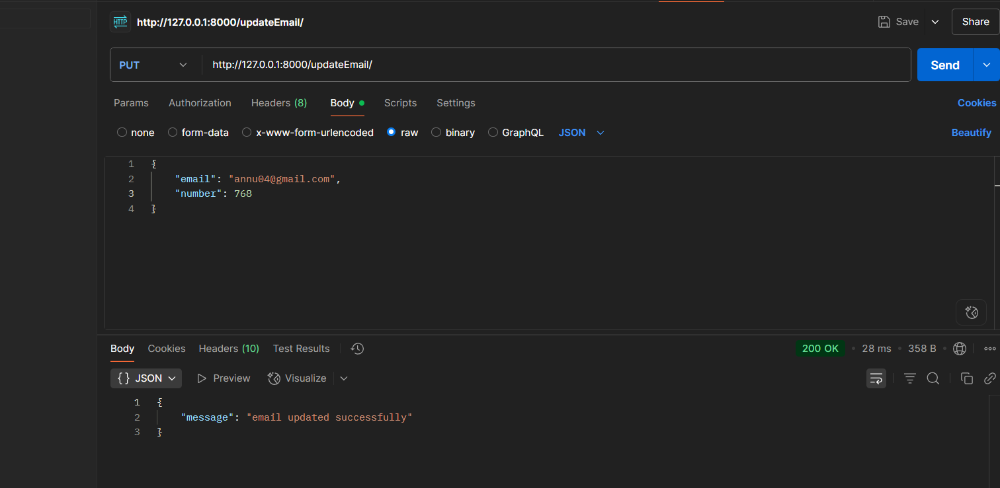
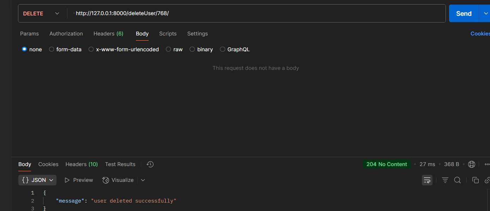

# Backend Bootcamp: Django REST API Development for LMS

---

## Course Objective

This bootcamp focuses on the **Backend Development and Deployment** phase of the Software Development Life Cycle (SDLC). Our goal is to equip you with the skills to build robust backend systems using **Django Framework**, **RDBMS**, **NoSQL**, **GIT**, **Docker**, and **AWS**, specifically for a Learning Management System (LMS).

---

## Bootcamp Schedule & Project Setup

### DAY 1: Setting Up Your Environment & Project Initialization

On Day 1, we lay the groundwork for our Django project, focusing on environment setup and understanding foundational Django concepts.

1.  **Installing Prerequisites**:
    * Install **Python** (ensure you have a recent version).
    * Install **Django** within a virtual environment.

2.  **Verifying Installations**:
    * Check Python version:
        `python --version`

3.  **Creating a Virtual Environment**:
    * Create a dedicated virtual environment for your project:
        `python -m venv env`

4.  **Activating Virtual Environment & Django Installation**:
    * Activate the virtual environment:
        `env\Scripts\activate.bat` *(Windows)*
        `source env/bin/activate` *(macOS/Linux)*
    * Install Django:
        `pip install django`
    * Verify Django installation:
        `django-admin --version`

5.  **Project Planning (LMS)**:
    * **Domain**: Education
    * **Personas**: Teachers, Students
    * **Core Features**: Signup/Login, Course Upload, Course Enroll

6.  **Creating a Django Project**:
    * Initialize the main Django project:
        `django-admin startproject LMS`

7.  **Understanding Project Structure**:
    * Explore the files and directories generated by `startproject`.

8.  **Creating a Django App (Courses)**:
    * Navigate into your project directory:
        `cd LMS`
    * Create a new app within your project (e.g., `courses`):
        `python manage.py startapp courses`

9.  **Understanding App Structure**:
    * Examine the files and directories generated for the `courses` app.

10. **MVC Architecture**:
    * Introduction to the Model-View-Controller pattern.

---

### DAY 2: MVT Architecture & REST API Development

Day 2 delves into Django's architecture and the principles of building RESTful APIs.

1.  **MVT Architecture (Model-View-Template)**:
    * A deep dive into Django's MVT architecture and its components.

2.  **Understanding REST API**:
    * Introduction to RESTful principles, HTTP methods, and status codes.

3.  **Data Modeling for `models.py`**:
    * Designing database schemas for LMS entities (e.g., Users, Courses, Enrollments) within Django's `models.py`.

4.  **Start Coding Part - Building the API**:

    * **Step 1: `settings.py` Configuration**:
        * Configure `INSTALLED_APPS`, database settings, etc.

    * **Step 2: `models.py` Implementation**:
        * Define your database models.

    * **Step 3: `urls.py` Definition**:
        * Map URLs to specific views for your API endpoints.

    * **Step 4: `serializers.py` (Django REST Framework)**:
        * Install Django REST Framework:
            `pip install djangorestframework`
        * Create serializers to convert Django model instances to JSON/XML and vice-versa.

    * **Step 5: `views.py` Logic**:
        * Implement the core logic for your API endpoints, handling various HTTP methods:
            * **`POST`**: For creating new resources (e.g., user signup).
            * **`GET`**: For retrieving resources.
            * **`PUT`**: For updating existing resources.
            * **`DELETE`**: For deleting resources.

---

### DAY 3: Database Integration & API Testing

On Day 3, we focus on integrating our Django application with a database and thoroughly testing our REST APIs using Postman.

1.  **Running the Django Development Server**:
    * Navigate to the project root (`LMS` directory):
        `cd LMS`
    * Start the server:
        `python manage.py runserver`

2.  **Solving Database Integration**:
    * Stop the server (Ctrl+C).
    * Create database migrations:
        `python manage.py makemigrations`
    * Apply migrations to create tables:
        `python manage.py migrate`
    * Create a superuser account:
        `python manage.py createsuperuser`
    * Restart the server:
        `python manage.py runserver`

3.  **Accessing Django Admin**:
    * Open your browser and navigate to `http://127.0.0.1:8000/admin/`.
    * Log in with your superuser credentials.

4.  **Registering Models in `admin.py`**:
    * Register your models in your app's `admin.py` (e.g., `courses/admin.py`):
        ```python
        # courses/admin.py
        from .models import lmsUser # Assuming lmsUser is one of your models
        from django.contrib import admin

        admin.site.register(lmsUser)
        ```

5.  **Adding Data from Server Side**:
    * Use the Django Admin panel to manually add users and other data.
      

6.  **Adding Data from Client Side (Postman)**:
    * Use Postman to make `POST` requests to your signup endpoint.
      

7.  **Testing POST, GET, PUT, DELETE with Postman**:

    * **`POST` Request (`http://127.0.0.1:8000/signup/`)**:
        
        *(Screenshot: Postman showing a successful POST request to the signup endpoint with request body and a 201 Created response.)*

    * **`GET` Request (`http://127.0.0.1:8000/getAllUser/`)**:
        
        *(Screenshot: Postman showing a successful GET request to retrieve all users with a 200 OK response and a JSON array of user data.)*

    * **`PUT` Request (`http://127.0.0.1:8000/updateEmail/`)**:
        
        *(Screenshot: Postman showing a successful PUT request to update a user's email with request body (e.g., user ID and new email) and a 200 OK response or similar success status.)*

    * **`DELETE` Request (`http://127.0.0.1:8000/deleteUser/<number>/`)**:
        
        *(Screenshot: Postman showing a successful DELETE request to remove a user (replace `<number>` with an actual user ID) with a 204 No Content or 200 OK response indicating successful deletion.)*

---

## Technologies Used

* **Python**
* **Django Framework**
* **Django REST Framework**
* **RDBMS** (e.g., SQLite - default, PostgreSQL)
* **NoSQL** (Introduction, if applicable for specific features)
* **GIT** (Version Control)

---

## Getting Started

To run this project locally, follow the steps outlined in **DAY 1** for setting up your environment and creating the project/app. Then, proceed with **DAY 2** and **DAY 3** to build and test the API. Remember to install Postman for API testing.

---

Feel free to contribute to this project or raise issues if you encounter any problems!
